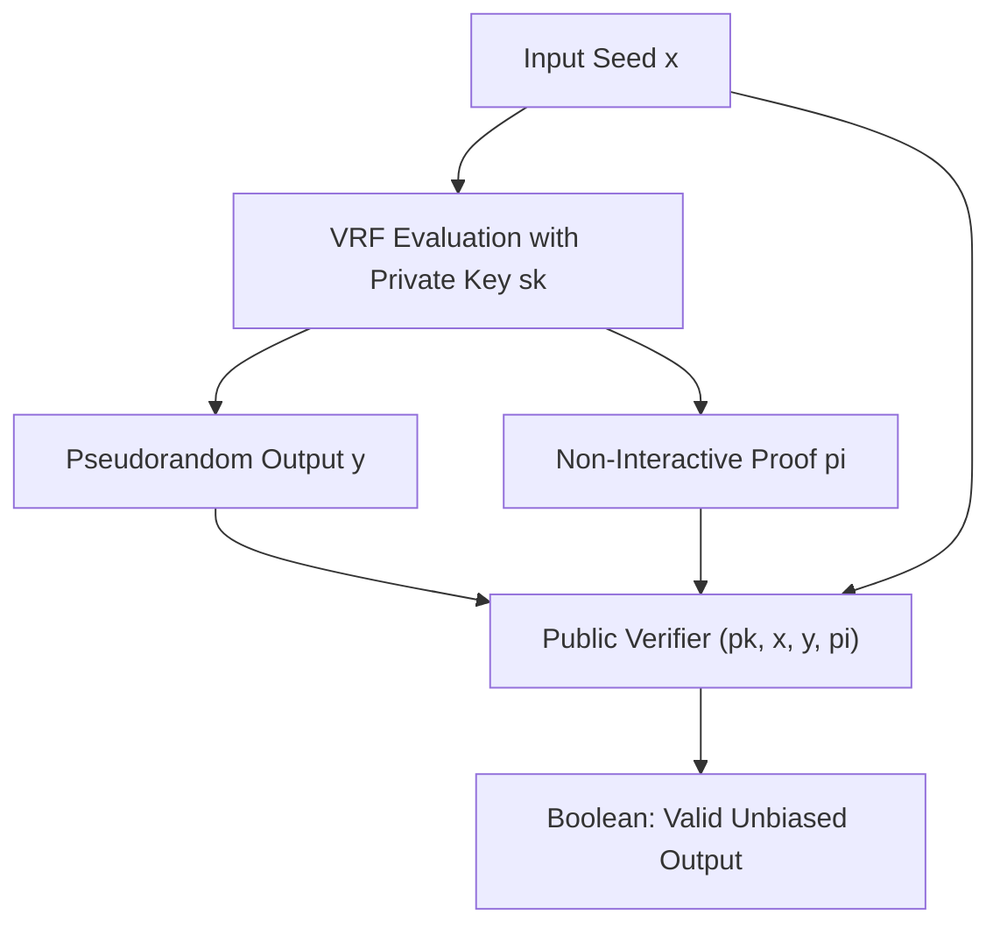

# Verifiable Random Function (VRF) Skill

High-efficiency, zero-dependency Python implementation of **Verifiable Random Functions (VRF)** for unbiased leader elections and lotteries.

## Features
- **Deterministic Pseudorandomness**: For any given input, output is unique and unpredictable without the private key.
- **Public Verifiability**: Anyone holding the public key can verify the proof without learning private keys.
- **Zero External Dependencies**: Pure Python standard library (`hashlib`).
- **Native MCP Protocol**: JSON-RPC 2.0 stdio server compatible with Claude Desktop, Cursor, and Windsurf.

## Architecture

